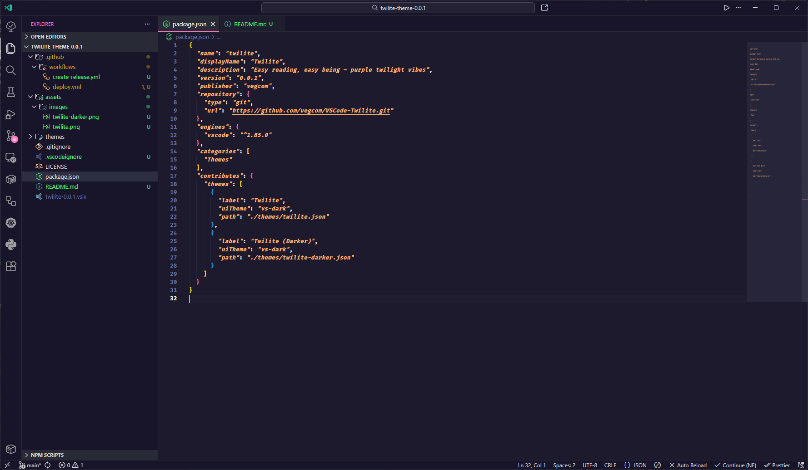
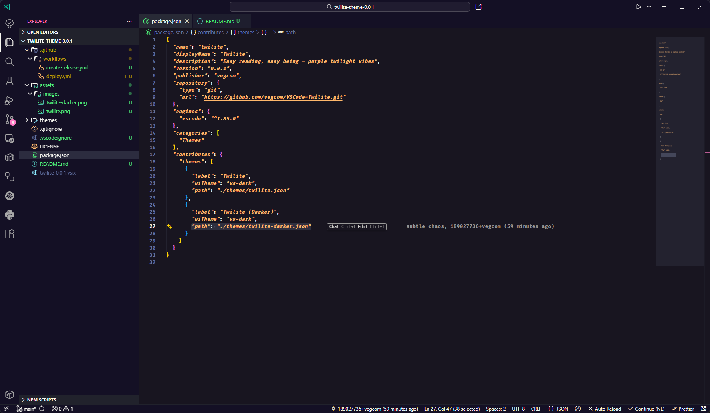

# Twilite VS Code

Based on [vegcom/Twilite-Theme](https://github.com/vegcom/Twilite-Theme.git)

## Examples

### Twilite

### Twilite Darker

## Attribution

Icons from: [Rosé Pine Theme](https://rosepinetheme.com/)